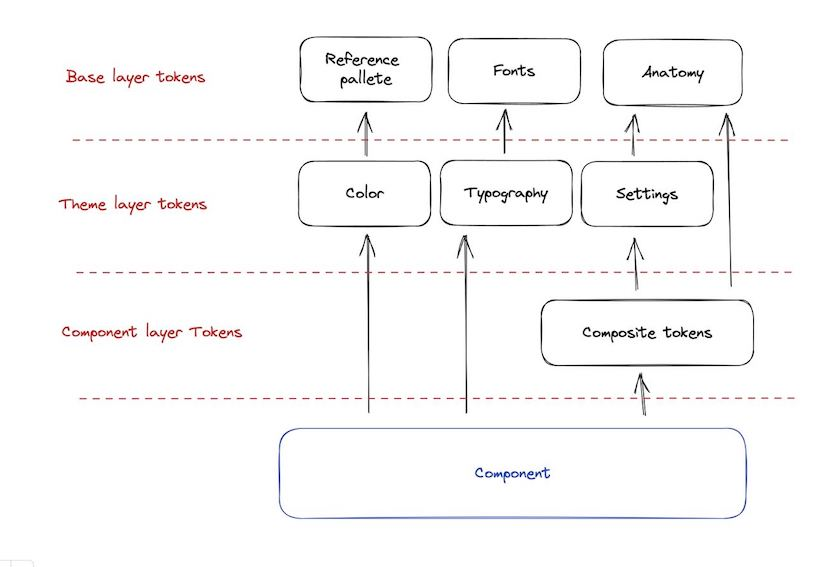

# CONTRIBUTION GUIDE

## Общие положения

> Все необходимые команды для работы с репозиторием описаны в разделе **NPM Scripts**

> Любые изменения в данном репозитории вносятся согласно [Conventional Commits](https://conventionalcommits.org), см. раздел **Conventional Commits**

> Основная структура репозитория представлена в разделе **Структура проекта**

> Сценарии работы с репозиторием можно посмотреть в разделе **Сценарии**

> Компоненты построены с учетом дизайн-токенов Figma. Подробнее об этом - в разделе **Работа с токенами**

## NPM Scripts

- `add-package` - создание нового пакета в рамках монорепозитория
- `build:storybook` - сборка исходников сторибука для *CI/CD*
- `build:packages` - пересборка пакетов вместе с установкой пакетных зависимостей, глобальные должны быть при этом установлены
- `build:css` - пересборка стилевых файлов в пакетах: scss -> css
- `build:ts` - пересборка файлов с кодом в пакетах: ts -> js 
- `changelog` - генерация changelog в измененных пакетах (используется только локально, дает возможность проверить корректность содержания коммитов) 
- `clean:all` - вызывает **clean:dist** и **clean:modules**
- `clean:buildinfo` - удаляет вспомогательные файлы для ts-сборки (**.tsbuildinfo**)
- `clean:dist` - удаляет **dist** в пакетах
- `clean:modules` - удаляет **node_modules** в пакетах
- `deps:all` - вызывает **deps:global** и **deps:packages**
- `deps:global` - устанавливает корневые зависимости и линкует пакеты между собой
- `deps:packages` - устанавливает зависимости внутри пакетов
- `deps:reinstall` - переустанавливает все зависимости начисто
- `storybook:all` - запуск локальной версии сторибука со *всеми* пакетами
- `storybook:ci` - запуск сторибука на *CI/CD*
- `storybook:partial` - запуск локальной версии сторибука с *определенными* пакетами
- `test:coverage` - генерит *cobertura* репорт для построчного покрытия тестами
- `test:testcafe` - запускает testcafe и прогоняет тесты
- `test:testcafe:local` - запускает testcafe в watch режиме, перезапускает при изменении исходного кода теста
- `test:testcafe:branch` - запускает testcafe против деплоя с текущей ветки (если деплой уже был). Требуется файл `.env`, в корне репозитория есть `.env.example`
- `test:ci` - запуск сервера сторибук и тестов на нем для *CI/CD*
- `test:unit` - запускает vitest и прогоняет тесты
- `test:unit:local` - запускает vitest в watch режиме, перезапускает при изменении исходного кода теста
- `validate:licenses` - запускает валидацию лицензий зависимых пакетов

## Conventional Commits

[Документация](https://conventionalcommits.org)

- Правило: один коммит - один пакет.
- Если вы все делаете правильно, поднятие и обновление зависимостей пакетов/пакетами происходит в автоматическом режиме, ровно как и changelog.
- Доступные типы коммитов:
    - **fix:**
        - коммит с префиксом **fix:**
          исправляет баг в коде (соответсвует версии PATCH в Semantic Versioning).
    - **feat:**
        - коммит с префиксом **feat:**
          добавляет новую функциональность (соответсвует версии MINOR в Semantic Versioning).
    - **!** или **BREAKING CHANGE:**
        - коммит с **!** после префикса (**fix(FF-11)!:**) или с футером **BREAKING CHANGE:**
          вносит критическое изменение без обратной совместимости (соответсвует версии MAJOR в Semantic Versioning).
        - может быть частью коммита любого типа.
    - другие доступные типы коммитов (основано на конвенции Angular-а):
      **build:**, **chore:**, **ci:**, **docs:**, **style:**, **refactor:**, **deps:**, **test:** и др.


## Структура проекта

1. Все компоненты лежат в папке `./packages`.
2. Структура папок пакетов:

```text
packages
  some-package
    src
    |  components
    |  |__Some
    |  |  |__index.ts
    |  |  |__Some.tsx
    |  |  |__styles.module.scss
    |  |  |__constants.ts (опционально)
    |  |  |__types.ts (опционально)
    |  |  |__utils.ts (опционально)
    |  |__index.ts
    |__styles.module.scss (опционально)
    |__constants.ts (опционально)
    |__types.ts (опционально)
    |__utils.ts (опционально)
    
    stories
    |__ Some.tsx
    
    __e2e__ (testcafe)
    |__some.ts

    __test__ (vitest) (опицонально)
    |__ some.spec.ts (.spec -  обязательная часть)
    
    package.json
    tsconfig.json
    README.md
    CHANGELOG.md
```

## Сценарии

### Начало работы с репозиторием

1. `npm run deps:all` для получения всех уже объявленных зависимостей
2. `npm run build:packages` для сборки пакетов

### Запуск локального storybook

1. `npm run build:packages`
2. Для запуска storybook
    - со всеми пакетами `npm run storybook:all`
    - с определенными пакетами `npm run storybook:partial`

### Создание нового пакета

1. Создайте feature ветку от последнего master
2. Запустите команду `npm run build:packages`
3. Запустите команду `npm run add-package`
4. Выпустите превью-пакет на ветке с токенами в [основном репозитории](https://git.sbercloud.tech/sbercloud-ui/tokens-design-system/figma-tokens) и заиспользуйте его в uikit-e.
5. Реализуйте необходимый компонент или утилиту согласно Conventional commit approach
6. Создайте pull request
7. Получите аппрув
8. `git pull -r origin master`, если это необходимо
9. Зарелизьте токены для компонента:
    - Смержите ветку с токенами в [основном репозитории](https://git.sbercloud.tech/sbercloud-ui/tokens-design-system/figma-tokens)
    - Дождитесь выпуска версии в  основном репозитории, а затем синхронизации форков и выпуска версии в них:
        - [Форк Cloud Platform](https://git.sbercloud.tech/sbercloud-ui/tokens-design-system/figma-tokens-cloud-platform)
        - [Форк MLSpace](https://git.sbercloud.tech/sbercloud-ui/tokens-design-system/figma-tokens-mlspace)
    - Заиспользуйте новые версии токенов в uikit
10. Для релиза первой стабильной версии необходимо
- `git fetch --all --prune --prune-tags `
- запустить `npm run changelog`
- В сгенерированном диффе поправить версии на необходимые
- сделать коммит
- запустить `lerna version --exact --message "Version bump"`
11. Убедитесь, что все изменения актуальны и правильны
12. Смержите в master

### Внесение изменений в существующий пакет

1. Создайте feature или bugfix ветку от последнего master
2. Запустите команду `npm run build:packages`
3. Внесите необходимые изменения согласно Conventional commit approach
4. Создайте pull request
5. Получите аппрув
6. Смержите вашу ветку в мастер.
7. Релиз пакетов произойдет на этапе CI, вам не нужно поднимать руками версии

### End-to-End Тестирование

1. Запустите локальный storybook через `storybook:ci`
2. Откройте `http://localhost:6006/` для проверки работоспособности
3. Тесты запускаются все вместе, если необходимо запустить конкретный - пометьте .only интересующую fixture или test
4. Запустите `test:testcafe:local`
5. Любое изменение кода выбранного файла с тестами перезапустит их выполнение
6. При написании тестов можно использовать типы из пакета. Но перед пушем типы пропсов нужно заменить на `Record<string, unknown>` или `any` <br />
    Импорты констант вида `... from '../src/components/constants'` можно использовать без ограничений

### Unit Тестирование

1. Запустите `test:testcafe:local`
2. Любое изменение кода выбранного файла с тестами перезапустит их выполнение
3. В меню при запуске можно выбрать соответсвующие настройки watch-режима

## Работа с токенами

### Семантика токенов:

Есть 3 слоя токенов - базовые, тематические и компонентные (лежат в папках Base, Theme и Components соответсвенно)
* Базовые - самые основные токены; внутри поделены на токены цветов, шрифтов и анатомии
* Тематические токены - ссылаются на базовые токены; сущетсвуют в двух модификациях для цветов - Light и Dark
* Токены компонентов - ссылаются на тематические токены (либо напрямую на базовые, если не требуется темизация каких-либо св-в); поделены покомпонентно



### Типы токенов
* Обычные - токены содержат одно св-во и применяются к конкретному св-ву css с помощью функции `simple-var` либо напрямую через css-var, если это простая переменная
```scss
.buttonLabel {
  color: simple-var($theme-variables, "sys", "primary", "on-accent");
  // или
  color: var($sys-primary-on-accent);
}
```
* Композитные (composite, typography, border) - токен внутри содержит несколько св-в css - их нужно применять внутри класса с помощью миксина `composite-var`
```scss
.buttonLabel {
  @include composite-var($theme-variables, "sans", "label", "size-s");
  // или
  @include composite-var($sans-label-size-s);
}
```
* Случаи-исключения:
    * Токен для св-ва outline - в фигме для него нет специального типа, поэтому для него используется композитный токен типа border. Соответвенно, для него понадобится свой миксин `outline-var`
```scss
.button {
  &:focus-visible {
    @include outline-var($container-focused-available-size-s);
  }
}
```

### Как использовать токены в компонентах

1. Проверьте, что в uikit подключен пакет `@sbercloud/figma-tokens` актуальной версии
2. Создайте файл для компонента (напр., `ButtonFilled.tsx`) и scss-файл для стилей (`styles.module.scss`), который импортится в файл компонента
3. Подключите файлы с токенами в `styles.module.scss` (тематические, компонентные - какие нужны):
    * файлы с токенами компонентов по умолчанию уже включают в себя тематические токены
```scss
@import '@sbercloud/figma-tokens/build/scss/styles-theme-variables';
@import '@sbercloud/figma-tokens/build/scss/components/styles-tokens-***';
```
4. Соберите стили компонента по макетам в figma, подключая токены через `var`, `simple-var` или `composite-var`
    * в scss можно также добавлять миксины и различные функции, чтобы убирать дублирование кода, пример:
```scss
// пример миксина, в других случаях код может быть другой

$sizes: s, m, l;
$variants: label-only, icon-only, label-icon;

@mixin button-anatomy-styles {
  @each $size in $sizes {
    &[data-size="#{$size}"] {
      @each $variant in $variants {
        &[data-variant="#{$variant}"] {
          @include composite-var($button-filled, 'container', $size, $variant);
        }
      }
    }
  }
}

.button {
  @include button-anatomy-styles;
}
```
5. Подключите scss-файл в компонент в виде объекта с класснеймами, и далее используйте следующим образом:

```tsx
import styles from './styles.module.scss';

export type ButtonFilledProps = {
  label?: string;
  size?: Size;
  variant?: Variant;
  disabled?: boolean;
  loading?: boolean;
};

export const ButtonFilled = ({ label, size, variant, disabled, loading }: ButtonFilledProps) => {
  return (
    <button
      className={styles.button}
      data-size={size}
      data-variant={variant}
      data-disabled={disabled || undefined}
      data-loading={loading || undefined}
    >
      <label className={styles.label}>{label}</label>
    </button>
  );
};

```
