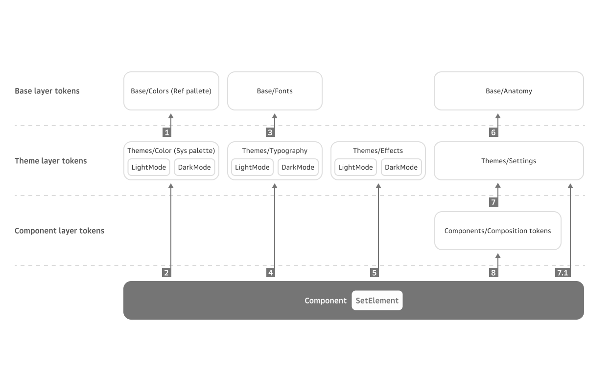

# CONTRIBUTION GUIDE

## Общие положения

> В проекте используется пакетный менеджер pnpm, что бы установить его глобально выполните команду `npm i -g pnpm@10.10.0`, для локальной установки выполните команду `npm i pnpm@10.10.0`

> Все необходимые команды для работы с репозиторием описаны в разделе **NPM Scripts**

> Любые изменения в данном репозитории вносятся согласно [Conventional Commits](https://conventionalcommits.org), см. раздел **Conventional Commits**

> Основная структура репозитория представлена в разделе **Структура проекта**

> Сценарии работы с репозиторием можно посмотреть в разделе **Сценарии**

> Компоненты построены с учетом дизайн-токенов Figma. Подробнее об этом - в разделе **Работа с токенами**

## NPM Scripts

- `add-package` -  Этот скрипт помогает вам создать новый пакет в вашем монорепозитории одним простым шагом, используя `ts-node`.

- `build:storybook` - Выполняет установку дополнительных тем, и собирает Storybook для использования в CI/CD. Использует конфигурацию в папке `storybook`.

- `build:packages:esm` - Выполняет сборку пакетов в формате ECMAScript Modules (ESM).

- `build:packages:cjs` - Выполняет сборку пакетов в формате CommonJS (CJS).

- `build:packages` - Очищает все, устанавливает зависимости в пакетах, выполняет команду `compile`, а затем собирает все TypeScript файлы и CSS стили.

- `build:css` - Запускает сборку CSS, компилируя из SCSS, и генерирует CSS-модули.

- `docgen` - Запускает генерацию документации для всех пакетов.

- `build:ts` - Запускает сборки для форматов CJS и ESM.

- `changelog` - Генерирует измененния в соответствии с недавними коммитами.

- `clean:all` - Выполняет последовательный запуск скриптов `clean:empty`, `clean:dist`, `clean:modules`, и `clean:buildinfo`.

- `clean:buildinfo`: Удаляет все файлы `.tsbuildinfo`, которые используются для инкрементальной компиляции.

- `clean:dist` - Удаляет директорию `dist` во всех пакетах, где собираются компилированные файлы.

- `clean:modules` - Удаляет директорию `node_modules` во всех пакетах.

- `clean:empty` - Запускает скрипт для очистки пустых пакетов.

- `deps:all` - Устанавливает все зависимости.

- `deps:reinstall` - Полностью удаляет текущие установки зависимостей и переустанавливает их.

- `storybook:all` - Запускает Storybook в dev mode с локальными сертификатами.

- `storybook:partial` - Запускает Storybook с определенными пакетами.

- `test:coverage` - Использует TestCafe для генерации отчетов о покрытии на каждый пакет.

- `test:ci` - Запускает тесты в режиме continuous integration, включая сборку и прогон тестов.

- `test:testcafe` - Запускает тесты с использованием TestCafe в браузере Chrome.

- `test:testcafe:local` - Запускает локальную версию тестов TestCafe.

- `test:testcafe:branch` - Выполняет TestCafe тестирование на развертывании ветки.

- `test:unit` - Запускает выполнение тестов Vitest в режиме однократного прогона.

- `test:unit:local` - Запускает Vitest в режиме просмотра с постоянным наблюдением за изменениями в коде.

- `install:themes` - Устанавливает дополнительные темы.

## Conventional Commits

[Документация](https://conventionalcommits.org)

- Правило: один коммит - один пакет.
- Если вы все делаете правильно, поднятие и обновление зависимостей пакетов/пакетами происходит в автоматическом режиме, ровно как и changelog.
- Доступные типы коммитов:
    - **fix:**
        - коммит с префиксом **fix:**
          исправляет баг в коде (соответсвует версии PATCH в Semantic Versioning).
    - **feat:**
        - коммит с префиксом **feat:**
          добавляет новую функциональность (соответсвует версии MINOR в Semantic Versioning).
    - **!** или **BREAKING CHANGE:**
        - коммит с **!** после префикса (**fix(FF-11)!:**) или с футером **BREAKING CHANGE:**
          вносит критическое изменение без обратной совместимости (соответсвует версии MAJOR в Semantic Versioning).
        - может быть частью коммита любого типа.
    - другие доступные типы коммитов (основано на конвенции Angular-а):
      **build:**, **chore:**, **ci:**, **docs:**, **style:**, **refactor:**, **deps:**, **test:** и др.


## Структура проекта

1. Все компоненты лежат в папке `./packages`.
2. Структура папок пакетов:

```text
packages
  some-package
    src
    |  components
    |  |__Some
    |  |  |__index.ts
    |  |  |__Some.tsx
    |  |  |__styles.module.scss
    |  |  |__constants.ts (опционально)
    |  |  |__types.ts (опционально)
    |  |  |__utils.ts (опционально)
    |  |__index.ts
    |__styles.module.scss (опционально)
    |__constants.ts (опционально)
    |__types.ts (опционально)
    |__utils.ts (опционально)
    
    stories
    |__ Some.tsx
    
    __e2e__ (testcafe)
    |__some.ts

    __test__ (vitest) (опицонально)
    |__ some.spec.ts (.spec -  обязательная часть)
    
    package.json
    tsconfig.json
    README.md
    CHANGELOG.md
```

## Сценарии

### Начало работы с репозиторием

1. `pnpm deps:all` для получения всех уже объявленных зависимостей
2. `pnpm build:packages` для сборки пакетов

### Запуск локального storybook

1. `pnpm build:packages`
2. Для запуска storybook
    - со всеми пакетами `pnpm storybook:all`
    - с определенными пакетами `pnpm storybook:partial`

### Создание нового пакета

1. Создайте feature ветку от последнего master
2. Запустите команду `pnpm build:packages`
3. Запустите команду `pnpm add-package`
4. Установите новую версию пакета figma-tokens, содержащую необходимые для компонента токены.
5. Реализуйте необходимый компонент или утилиту согласно Conventional commit approach
6. Создайте pull request
7. Получите аппрув
8. `git pull -r origin master`, если это необходимо
9. Убедитесь, что все изменения актуальны и правильны
10. Смержите в master

### Внесение изменений в существующий пакет

1. Создайте feature или bugfix ветку от последнего master
2. Запустите команду `pnpm build:packages`
3. Внесите необходимые изменения согласно Conventional commit approach
4. Создайте pull request
5. Получите аппрув
6. Смержите вашу ветку в мастер.
7. Релиз пакетов произойдет на этапе CI, вам не нужно поднимать руками версии

### End-to-End Тестирование

1. Запустите локальный storybook через `storybook:ci`
2. Откройте `http://localhost:6006/` для проверки работоспособности
3. Тесты запускаются все вместе, если необходимо запустить конкретный - пометьте .only интересующую fixture или test
4. Запустите `test:testcafe:local`
5. Любое изменение кода выбранного файла с тестами перезапустит их выполнение
6. При написании тестов можно использовать типы из пакета. Но перед пушем типы пропсов нужно заменить на `Record<string, unknown>` <br />
    Импорты констант вида `... from '../src/components/constants'` можно использовать без ограничений

### Unit Тестирование

1. Запустите `test:testcafe:local`
2. Любое изменение кода выбранного файла с тестами перезапустит их выполнение
3. В меню при запуске можно выбрать соответсвующие настройки watch-режима

## Работа с токенами

### Семантика токенов:

Есть 3 слоя токенов - базовые, тематические и компонентные (лежат в папках Base, Theme и Components соответсвенно)
* Базовые - самые основные токены; внутри поделены на токены цветов, шрифтов и анатомии
* Тематические токены - ссылаются на базовые токены; сущетсвуют в двух модификациях для цветов - Light и Dark
* Токены компонентов - ссылаются на тематические токены (либо напрямую на базовые, если не требуется темизация каких-либо св-в); поделены покомпонентно


### Типы токенов
* Обычные - токены содержат одно св-во и применяются к конкретному св-ву css с помощью функции `simple-var` либо напрямую через css-var, если это простая переменная
```scss
.buttonLabel {
  color: simple-var($theme-variables, "sys", "primary", "on-accent");
  // или
  color: $sys-primary-on-accent;
}
```
* Композитные (composite, typography, border) - токен внутри содержит несколько св-в css - их нужно применять внутри класса с помощью миксина `composite-var`
```scss
.buttonLabel {
  @include composite-var($theme-variables, "sans", "label", "size-s");
  // или
  @include composite-var($sans-label-size-s);
}
```
* Случаи-исключения:
    * Токен для св-ва outline - в фигме для него нет специального типа, поэтому для него используется композитный токен типа border. Соответвенно, для него понадобится свой миксин `outline-var`
```scss
.button {
  &:focus-visible {
    @include outline-var($container-focused-available-size-s);
  }
}
```

## Связи слоёв токенов


1. **Base/Colors (References pallete)**
Базовые переменные для формирования System palette
Это наборы тонов для каждого цвета, где каждый тон имеет порядковый номер. Каждый цвет разложен на 20 тонов от самого тёмного до самого светлого.
Для единого представления каждым человеком о цвете, они именуются простейшими цветами радуги.
Любые изменения переменных отразятся на System palette

2. **Themes/Color (System palette)**
Набор семантических стилей, применяется на Components или его элементах напрямую как в фигма, так и коде.  Эти стили не используются в Composition токенах. Включение цвета в Composition токены приведет к порождению большого количества однообразных токенов в которых меняется только цвет, так как при изменении состояния компонента необходимо менять цвет, следовательно возникнет потребность в создании еше одного Composition токена. 
System палитра, в отличии от References, обладает меньшим количеством цветов.
System палитра имеет 2 модификации - темная и светлая. Эти модификации наследуют разные тона References палитры, наследие тонов заведомо распределено и переопределяется при переключении модификации.
Любые изменения переменных отразятся на Components.

3. **Base/Fonts**
Набор базовых переменных для построения стилей типографики - семейство шрифтов, вес шрифта, высота строки, размер шрифта, интервал между буквами, интервал между абзацами, декоратор текста
Любые изменения переменных отразятся на Typography

4. **Themes/Typography**
Набор семантических стилей типографики, применяются к компоненту напрямую в фигма и коде.Семантика стилей разделена на 5 ролей, для каждой роли задаётся по 3 размера.
Typography имеет 2 модификации - темная и светлая, возможно переопределение стилей с  модификацией.
Цвет типографики устанавливается в компоненте из Themes/Color 
Любые изменения переменных отразятся на Components

5. **Themes/Effects**
Переменные для эффектов - тени или размытия
Набор семантических стилей, применяется на Components или его элементах напрямую как в фигма, так и коде.
Effects имеет 2 модификации - темная и светлая. Эти модификации могут быть с разными настройками эффектов.
Любые изменения переменных отразятся на Components

6. **Base/Anatomy**
Базовые переменные для формирования анатомических свойства компонентов  - размеров, отступов, бордеров, скруглений и непрозрачности.
Любые изменения переменных отразятся на Settings

7. **Themes/Settings**
Переменные, семантически связанные с анатомическими свойствами Components.
Это переменные для настройки анатомических свойств компонентов темы. Переменные используются в Composition tokens, это позволяет вносить изменения в анатомию компонента без изменения токена применённого на самом компоненте. Переменные могут иметь математические вычисления, что не допустимо на слое Components.
Переменные сгруппированы по анатомическим свойствам.
Любые изменения переменных отразятся на Composition token.

    * 7.1 **Themes/Settings**
      Переменные, семантически связанные с анатомическими свойствами Components.
      Возможно прямое применение на компоненте как в фигма, так и коде в случаях когда Composition token создает ограничение в реализации компонента в коде. Например, оффсет дроплиста может применяться с одной из 4 его сторон, в зависимости от того, где расположен его триггер. В таком случае не получится задать этот оффсет в каком-то конкретном направлении (а значит, не стоит использовать Composition token).
      В этом случае не допустимы математические вычисления в токене.
      Любые изменения переменных отразятся на Components или элементе Components.

8. **Themes/Settings**
Переменные, семантически связанные с анатомическими свойствами Components.
Возможно прямое применение на компоненте как в фигма, так и коде в случаях когда Composition token создает ограничение в реализации компонента в коде. Например, оффсет дроплиста может применяться с одной из 4 его сторон, в зависимости от того, где расположен его триггер. В таком случае не получится задать этот оффсет в каком-то конкретном направлении (а значит, не стоит использовать Composition token).
В этом случае не допустимы математические вычисления в токене.
Любые изменения переменных отразятся на Components или элементе Components.

9. **Components/Composition tokens**
Переменные, семантически связанные с Components или набором элементов Components.
Эти переменные объединяют в себе несколько параметров анатомии компонента, значения переменных зависят от Settings
Применяется на Components или его элементах напрямую как в фигма, так и коде.
Не допустимы математические вычисления в значениях переменных.
Любые изменения переменных отразятся на Components.

### Как использовать токены в компонентах

1. Проверьте, что в uikit подключен пакет `@snack-uikit/figma-tokens` актуальной версии
2. Создайте файл для компонента (напр., `ButtonFilled.tsx`) и scss-файл для стилей (`styles.module.scss`), который импортится в файл компонента
3. Подключите файлы с токенами в `styles.module.scss` (тематические, компонентные - какие нужны):
    * файлы с токенами компонентов по умолчанию уже включают в себя тематические токены
```scss
@use '@snack-uikit/figma-tokens/build/scss/styles-theme-variables';
@use '@snack-uikit/figma-tokens/build/scss/components/styles-tokens-***';
```
4. Соберите стили компонента по макетам в figma, подключая токены через `var`, `simple-var` или `composite-var`
    * в scss можно также добавлять миксины и различные функции, чтобы убирать дублирование кода, пример:
```scss
@use '@snack-uikit/figma-tokens/build/scss/styles-theme-variables';
@use '@snack-uikit/figma-tokens/build/scss/components/styles-tokens-button-buttonFilled';

$sizes: s, m, l;
$variants: label-only, icon-only, label-icon;

@mixin button-anatomy-styles {
  @each $size in $sizes {
    &[data-size="#{$size}"] {
      @each $variant in $variants {
        &[data-variant="#{$variant}"] {
          @include styles-theme-variables.composite-var(styles-tokens-button-buttonFilled.$button-filled, 'container', $size, $variant);
        }
      }
    }
  }
}

.button {
  @include button-anatomy-styles;
}
```
5. Подключите scss-файл в компонент в виде объекта с именами CSS-классов, и далее используйте следующим образом:

```tsx
import styles from './styles.module.scss';

export type ButtonFilledProps = {
  label?: string;
  size?: Size;
  variant?: Variant;
  disabled?: boolean;
  loading?: boolean;
};

export const ButtonFilled = ({ label, size, variant, disabled, loading }: ButtonFilledProps) => {
  return (
    <button
      className={styles.button}
      data-size={size}
      data-variant={variant}
      data-disabled={disabled || undefined}
      data-loading={loading || undefined}
    >
      <label className={styles.label}>{label}</label>
    </button>
  );
};

```

## Документация

В репозитории настроена автоматическая документация компонентов. Решение опирается на пакет [react-docgen](https://react-docgen.dev/).
Вы можете запустить генерацию документации скриптом `pnpm docgen`.
Для описания пропсов компонентов используется синтаксис [JSDoc](https://jsdoc.app/).

Генерируемая документация представляет из себя таблицу с колонками:
 - `name` - название пропсы, для обязательных пропсов используется нотация с символом `*`, например `position*`.
 - `type` - тип пропсы. Выводится автоматически, но может быть переопределена директивой `@type`.
 - `default` - значение по умолчанию. Выводится автоматически, но не всегда. Может быть определена директивой `@default`.
 - `description` - описание пропсы. Если тип пропсов строится через union, то описания полей склеиваются.

Пример описания пропсов компонента:

```tsx
export type AlertProps = {
  /**
   * Заголовок уведомления
   */
  title: string;
  /**
   * Позиция уведомления
   * @default Position.Top
   */
  position: Position;
}
```

### README.md

Файлы README.md содержат как автогенерируемую информацию, так и вводимую вручную.
Автогенерируемая часть находится между специальными отметками:
```text
[//]: DOCUMENTATION_SECTION_START
[//]: THIS_SECTION_IS_AUTOGENERATED_PLEASE_DONT_EDIT_IT
```
```text
[//]: DOCUMENTATION_SECTION_END
```

> ### **Не редактируйте вручную все что находится между ними!**

### Экспортируемые компоненты

По умолчанию механизм автодокументации рассматривает экспортируемые сущности как React-компоненты.
Если из пакета экспортируются функции, таковыми не являющиеся,
для корректной документации они должны быть помечены директивой `@function`.

Пример:
```tsx
/**
 * Хук реализует обратный отсчет до указанного времени
 * @function hook
 */
export function useCountdown(time: number): string {
  // ...
}
```

Некоторые пакеты экспортируют компоненты как поля других компонентов, обозначая связь их использования.

Пример:
```tsx
<Tabs.TabBar>
  <Tabs.Tab {...tab1props} />
  <Tabs.Tab {...tab2props} />
  <Tabs.Tab {...tab3props} />
</Tabs.TabBar>
```

Для корректной генерации документации по таким компонентам следует экспортировать их через `namespace`:

Пример:
```tsx
export function Tabs(props) {/* ... */}

export namespace Tabs {
  export const Tab = TabComponent;
  export const TabBar = TabBarComponent;
}
```

### Pre-commit

Генерация документации запускается на пре-коммите. Если в `git stage` присутствуют файлы какого-либо пакета,
то на пре-коммите для этого пакета будет запущена генерация документации и файл `README.md` также будет добавлен в коммит.

